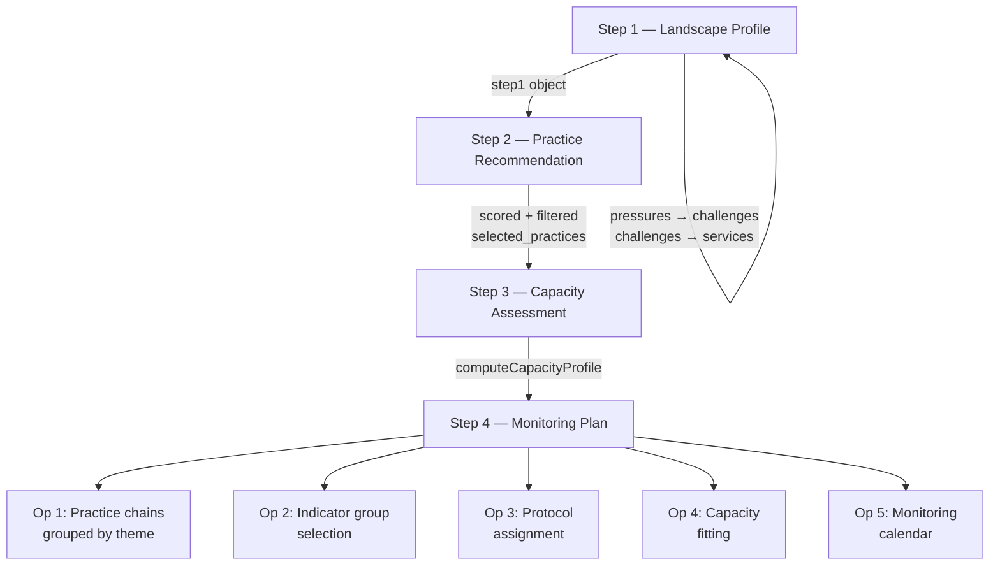

# LAHMP — Land Health Monitoring Platform

**A browser-based self-assessment wizard that generates personalised biodiversity monitoring plans for agricultural and semi-natural landscapes.**

[](https://daimpad.github.io/LAHMP)
[](LICENSE)
[](https://github.com/daimpad/LAHMP/commits/main)
[](https://github.com/daimpad/LAHMP/graphs/contributors)
[](https://github.com/daimpad/LAHMP)
[](https://github.com/daimpad/LAHMP/issues)

---

## Overview

LAHMP is a functional prototype of a four-step land health self-assessment tool developed for the **IUCN Nature-Based Solutions Hub**. It operationalises the *IUCN Land Health Monitoring Framework (LHMF)*, connecting sustainable agricultural practices to measurable biodiversity indicators through a structured, evidence-based workflow.

A practitioner — land manager, field ecologist, NGO programme officer, or monitoring coordinator — works through four sequential steps:

1. **Landscape Profile** — characterise the site by location, land use, pressures, degradation challenges, and priority ecosystem services
2. **Practice Recommendation** — receive a scored and ranked shortlist of sustainable land management practices matched to the site's pressure profile
3. **Capacity Assessment** — declare team composition, field time, equipment, budget, and seasonal site access
4. **Monitoring Plan** — receive an auto-generated, capacity-fitted monitoring programme: biological indicator protocols, abiotic baselines, a 12-month survey calendar, and a plain-language narrative

The output is a complete monitoring plan rendered in the browser and printable via `window.print()`. No server, no accounts, no API calls.

### Key objectives

- **Logic validation** — verify that the LHMF scoring and filtering algorithms produce scientifically coherent outputs for known test landscapes
- **Stakeholder demonstration** — share a working prototype with project partners and funders via a static URL
- **Development testbed** — confirm JSON knowledge-base structure against algorithm output before production implementation in Laravel/Vue.js

---

## Architecture

### System overview

LAHMP is a **single-page application** with zero build tooling. All logic runs in the browser against static JSON knowledge bases. There is no backend, no API, and no authentication layer.

```
┌─────────────────────────────────────────────────────────────────┐
│  Browser                                                        │
│                                                                 │
│  index.html ──── presentation shell (113 lines)                 │
│  wizard.js  ──── all state management + algorithm logic         │
│  styles.css ──── IUCN brand styling                             │
│                                                                 │
│  data/                                                          │
│  ├── reference.json    ← pressures (28), challenges (35),       │
│  │                       services (37), EFG options,            │
│  │                       pre-population mapping tables          │
│  ├── practices.json    ← 43 sustainable land management         │
│  │                       practices with scoring metadata        │
│  ├── indicators.json   ← 41 biological indicator profiles       │
│  │                       with 3-level protocol assignments      │
│  └── abiotic.json      ← 16 abiotic baseline indicators         │
│                                                                 │
│  localStorage ─────────── session persistence (resume on        │
│                            reload; not a data store)            │
└─────────────────────────────────────────────────────────────────┘
```

### Data flow



### Technology stack

| Concern | Choice | Rationale |
|---|---|---|
| Language | Vanilla ES2020 JavaScript | No build tooling; directly shareable via GitHub Pages |
| Markup | HTML5 | Single file, no templating engine |
| Styling | CSS custom properties | IUCN brand tokens; zero runtime overhead |
| Fonts | IBM Plex Sans / Serif / Mono | IUCN-aligned; loaded via Google Fonts CDN |
| Data | Static JSON | Exported from canonical Excel knowledge bases |
| Persistence | `localStorage` | Wizard resume across page reloads |
| Hosting | GitHub Pages | Zero-infrastructure; no server required |
| PDF output | `window.print()` + print CSS | No Puppeteer or server-side rendering |

---

## Installation

### Prerequisites

- A modern browser (Chrome ≥ 105, Firefox ≥ 104, Safari ≥ 16, Edge ≥ 105)
- A static file server for local development (the wizard loads JSON via `fetch`, which requires HTTP — opening `index.html` directly from disk will fail due to CORS restrictions)

Python 3, Node.js, or any other static server will work:

```bash
# Python 3
python3 -m http.server 8080

# Node.js (npx)
npx serve .

# Node.js (http-server)
npx http-server . -p 8080
```

### Local setup

```bash
git clone https://github.com/daimpad/LAHMP.git
cd LAHMP
python3 -m http.server 8080
# Open http://localhost:8080
```

No `npm install`, no build step, no environment variables.

---

## Usage

### Live deployment

```
https://daimpad.github.io/LAHMP
```

### URL parameters

| Parameter | Values | Effect |
|---|---|---|
| `?fixture=` | `TEST-01`, `TEST-02`, `TEST-03` | Pre-loads a complete test assessment |
| `&step=` | `1`, `2`, `3`, `4` | Jumps directly to the specified step |

**Examples:**

```
# Load the Skoura M'Daz Morocco test case, jump to Step 4 output
https://daimpad.github.io/LAHMP?fixture=TEST-01&step=4

# Load the Vietnam VSA test case at Step 1
https://daimpad.github.io/LAHMP?fixture=TEST-03
```

### Test landscapes

Three pre-configured fixtures cover distinct land system types and climate zones:

| ID | Name | Location | Primary EFG | Key pressures |
|---|---|---|---|---|
| `TEST-01` | Skoura M'Daz | Drâa-Tafilalet, Morocco | T7.2 — Sown pastures | Overgrazing, soil erosion, drought |
| `TEST-02` | PK-17 | Trarza, Mauritania | T7.5 — Semi-natural pastures | Desertification, overgrazing, invasive species |
| `TEST-03` | Vietnam VSA | Mekong Delta, An Giang | T7.1 + F3.3 — Annual cropland / Rice paddies | Pesticide use, water pollution, agrobiodiversity loss |

### Typical workflow

1. Open the wizard and enter landscape location details (Step 1, Block 1)
2. Select IPCC land use categories, EFG codes, and soil types (Block 1.2)
3. Mark active pressures for each of 28 pressure types (Block 4); Block 5 challenges auto-populate
4. Confirm relevant land health challenges and rank priority ecosystem services (Blocks 5–6)
5. Complete the pre-screen and review scored practice recommendations; select your programme's practices (Step 2)
6. Declare team composition, field days, equipment, budget, and seasonal access calendar (Step 3)
7. Step 4 generates automatically: review the narrative, indicator tables, and 12-month calendar; print via the browser print dialog

The wizard saves state to `localStorage` after every input — closing and reopening the tab resumes from the last position.

---

## Configuration

### IUCN brand tokens

Defined as CSS custom properties in `styles.css`:

```css
:root {
  --iucn-navy:   #003478;
  --iucn-yellow: #FDC82F;   /* action/accent only — never decorative */
  --iucn-green:  #1A7A52;
}
```

### Knowledge base data files

All content is loaded at runtime from `data/`. These files are the canonical source of truth for the browser application. **Do not edit them directly** — they are generated by the export scripts in `export/`.

| File | Records | Description |
|---|---|---|
| `data/reference.json` | 28 pressures, 35 challenges, 37 services, 15 IPCC land use categories, 10 soil types, ~120 EFG options | Block 4/5/6 lists and pre-population mapping tables |
| `data/practices.json` | 43 practices across 11 themes | Practice Matrix: scoring metadata, eligibility rules, pre-screen linkages |
| `data/indicators.json` | 41 profiles (36 Universal, 5 Conditional) | Indicator Linkage Matrix: 3-level protocol assignments, seasonal windows, EFG/IPCC linkages |
| `data/abiotic.json` | 16 indicators | Abiotic Reference Table: baseline measurement protocols and universal baseline flags |

### Assessment state object

All wizard state is held in `window.assessment`. Its structure is intentionally identical to the production assessment record JSON so prototype data can directly test the production algorithm:

```js
window.assessment = {
  assessment_id:  String,   // UUID — generated on first load
  landscape_name: String,
  created_at:     ISO8601,
  last_updated:   ISO8601,
  step1:          { /* landscape profile */ },
  step2:          { /* selected practices */ },
  step3:          { /* capacity inputs */ },
  step4_outputs:  { /* algorithm outputs */ },
};
```

See `CLAUDE.md` for the complete field-level schema.

---

## Development

### Repository structure

```
lahmp/
├── index.html                    ← Presentation shell — structural HTML only
├── wizard.js                     ← All state management and algorithm logic (~2 200 lines)
├── styles.css                    ← IUCN brand styling (~1 000 lines)
├── data/
│   ├── reference.json
│   ├── practices.json
│   ├── indicators.json
│   ├── abiotic.json
│   └── test_fixtures/
│       ├── TEST-01.json          ← Skoura M'Daz, Morocco
│       ├── TEST-02.json          ← PK-17, Mauritania
│       └── TEST-03.json          ← Vietnam VSA
├── export/
│   ├── convert.py                ← Excel → JSON export script
│   └── extract_indicators.py     ← DOCX → indicators.json extraction script
├── CLAUDE.md                     ← Canonical developer specification
└── LICENSE
```

### `wizard.js` internal structure

The file is organised into clearly labelled sections that map to the step and operation numbers in the specification documents:

```
Constants and lookup tables
  MONTHS, TEAM_PROTOCOL_LEVEL, BUDGET_OPTS, THEME_TO_CHAIN,
  PRESSURE_LAND_USE_KEYWORDS, PRESCREEN_ANSWERS, SITE_COUNT_MIDPOINT

Assessment state initialisation

Step 1 algorithms
  prepopulateChallenges(pressures, landUseComposition)
  prepopulateServices(challenges)
  scorePractice(practice, step1)

Step 3 algorithms
  computeCapacityProfile(step3)

Step 4 algorithms
  Operation 1 — practice chain grouping
  Operation 2 — selectIndicatorGroups(indicators, step1, step2)
  Operation 3 — assignProtocol(group, capacityProfile)
  Operation 4 — capacityFit(groups, cap, step2, step1)
  Operation 5 — buildMonitoringCalendar(groups, accessCalendar)
               └── parseSeasonalWindow(text)
               └── splitIntoWindows(indices)
               └── stageSpeed(monitoringStage)

runStep4Algorithm()

Render functions
  renderStep1(), renderStep2(), renderStep3(), renderStep4()

Event wiring, navigation, localStorage persistence
```

### Code conventions

- **All algorithm logic in `wizard.js`** — render functions in the same file for simplicity, but clearly separated
- **All content from `data/`** — no labels, option lists, or tooltips are hardcoded in JS or HTML
- **Function names match spec terminology** — `prepopulateChallenges`, `scorePractice`, `assignProtocol`, `computeCapacityProfile`, `selectIndicatorGroups`
- **No external dependencies** — no npm, no bundler, no polyfills beyond what browsers provide natively

### Updating the knowledge bases

The Excel workbooks are the canonical source of truth. Always edit the Excel file, then re-export to JSON. Never edit the JSON files directly.

```bash
# Re-export practices.json, abiotic.json, reference.json from Excel
cd export/
pip install pandas openpyxl
python3 convert.py

# Re-extract all 41 indicator profiles from DOCX source files
python3 extract_indicators.py
# Downloads DOCX files from GitHub, caches to indicators_dl/, writes data/indicators.json
```

---

## Testing

### Manual end-to-end validation

The primary test mechanism is loading a pre-configured test fixture and inspecting Step 4 output:

```
# Full run
https://daimpad.github.io/LAHMP?fixture=TEST-01

# Jump directly to output
https://daimpad.github.io/LAHMP?fixture=TEST-01&step=4
https://daimpad.github.io/LAHMP?fixture=TEST-02&step=4
https://daimpad.github.io/LAHMP?fixture=TEST-03&step=4
```

### What to verify

| Check | Expected |
|---|---|
| Block 5 pre-population | Challenges appear when Block 4 pressures are marked `ongoing`; confidence degrades to `medium` for `past`/`not_sure`; disappears for `not_relevant` |
| Area weighting | Marking overgrazing `ongoing` in a landscape with < 10% grassland area produces `medium` (not `high`) confidence challenges |
| Practice scoring | Practices with higher Block 4/5/6 overlap score higher; score displayed on each card |
| Protocol assignment | TEST-03 (Types C + D, budget tier 3) should assign Level 2–3 protocols; TEST-02 (Types A + B, budget tier 1) should assign Level 1 |
| Calendar windows | TEST-02 constrained months (April–June) should not appear as suggested monitoring windows |
| Capacity trimming | Low-capacity profiles (few days, low budget) should produce a trimmed group list in "Enhancement recommendations" |

### Algorithm simulation

`export/extract_indicators.py` includes a Python simulation of the Step 4 selection algorithm that was used during development to validate indicator counts against the three test fixtures. Run it directly to re-validate:

```bash
cd export/
python3 extract_indicators.py --validate-only
# Expected: TEST-01 ~29 indicators, TEST-02 ~23, TEST-03 ~30
```

<!-- TODO: Formalise this into a standalone test script with assertions -->

### Testing strategy

This prototype has no automated test runner. The testing approach is:

1. **Fixture-based end-to-end** — the three test fixtures provide known inputs with expected output characteristics
2. **Algorithm simulation** — Python equivalents of the JS algorithms in `extract_indicators.py` were used to verify selection logic during development
3. **Manual inspection** — the rendered Step 4 output is reviewed against the scientific specification by domain experts

Automated unit tests (Jest or similar) are planned for LAHMP v1 (the production Laravel application).

---

## Deployment

### GitHub Pages

The prototype is deployed automatically to GitHub Pages from the `main` branch. No CI/CD pipeline is configured — any push to `main` that modifies `index.html`, `wizard.js`, `styles.css`, or `data/` is immediately live.

```
Production URL: https://daimpad.github.io/LAHMP
Branch:         main
Deploy trigger: push to main (GitHub Pages auto-deploy)
Build step:     none
```

### Deployment checklist

Before pushing changes that affect algorithm behaviour:

- [ ] Verify all three test fixtures render correctly at `?fixture=TEST-0N&step=4`
- [ ] Confirm JSON files were exported from the canonical Excel source (not edited manually)
- [ ] Check browser console for JavaScript errors on initial load and on each step transition
- [ ] Verify `localStorage` resume works: fill Step 1, reload, confirm state is preserved

### Environments

| Environment | URL | Branch |
|---|---|---|
| Production | `https://daimpad.github.io/LAHMP` | `main` |
| Local development | `http://localhost:8080` | any |

There is no staging environment. Breaking changes should be developed on a feature branch and reviewed before merging to `main`.

---

## Contributing

### Scope of this prototype

Before contributing, note what is **deliberately out of scope** for this prototype and belongs to LAHMP v1 (the production Laravel application):

| Feature | Reason deferred |
|---|---|
| GEO API (globalecosystems.org polygon query) | Requires server, API key, CORS handling |
| ABC Map / FAO API for IPCC land use | Same |
| Leaflet polygon drawing | Prototype uses manual text inputs |
| User accounts and saved assessments | No server |
| PDF generation | `window.print()` is the prototype approach |
| LLM/AI narrative generation | IUCN AI policy clearance pending |
| Darwin Core field alignment | v2 feature |
| Automated test suite | Planned for v1 |

### Adding a new indicator profile

1. Author the profile content in `LAHMP_Indicator_Profile_Template.docx`
2. Add the row to `LAHMP_Indicator_Linkage_Matrix_Populated.xlsx` (canonical source)
3. Run `python3 export/extract_indicators.py` to regenerate `data/indicators.json`
4. Load `?fixture=TEST-01&step=4` and verify the new profile appears when its P-code linkages match the test landscape's selected practices
5. Confirm `"populated": true` is set in the generated JSON entry

### Branching strategy

```
main          ← production (GitHub Pages)
feature/*     ← new features or data updates
fix/*         ← bug fixes
data/*        ← knowledge base updates only (JSON re-exports)
```

Pull requests to `main` require at least one review. Squash-merge preferred for feature branches to keep history readable.

### Commit style

Follow Conventional Commits loosely:

```
feat: add conditionality check for conditional indicator profiles
fix: correct THEME_TO_CHAIN keys to match actual practice themes
data: re-export indicators.json from populated DOCX source files
docs: update README deployment section
```

### Code review checklist

- [ ] No hardcoded content in `wizard.js` or `index.html` — all labels/options loaded from `data/`
- [ ] No new external dependencies introduced
- [ ] Algorithm changes tested against all three test fixtures
- [ ] JSON schema changes are backward-compatible with existing fixture files
- [ ] `CLAUDE.md` updated if the developer specification has changed

---

## References

### Scientific framework

- [IUCN Global Ecosystem Typology 2.0](https://global-ecosystems.org/) — EFG classification system used for landscape characterisation and indicator linkage
- [IPCC Guidelines for National Greenhouse Gas Inventories — Land Use Categories](https://www.ipcc-nggip.iges.or.jp/public/2006gl/vol4.html) — IPCC land use category framework used in Step 1
- [IUCN Nature-Based Solutions](https://www.iucn.org/our-work/nature-based-solutions) — Organisational context for the LHMF
- [Ecdysis Foundation 1000 Farms Protocol](https://ecdysis.bio/) — Field-level biological monitoring methodology referenced in indicator profiles
- [ISO 23611-1 — Soil quality: Sampling of soil invertebrates](https://www.iso.org/standard/73135.html) — Protocol standard for earthworm sampling (Profile 06)

### Biodiversity monitoring standards

- [SEBI (Streamlining European Biodiversity Indicators)](https://www.eea.europa.eu/themes/biodiversity/indicators) — European biodiversity indicator framework
- [UK Countryside Survey methodology](https://countrysidesurvey.org.uk/) — Reference for vegetation quadrat and invertebrate survey protocols
- [BTO/JNCC/RSPB Breeding Bird Survey](https://www.bto.org/our-science/projects/bbs) — Protocol reference for farmland bird point counts (Profiles 19–21)
- [UK Bat Conservation Trust Good Practice Guidelines](https://www.bats.org.uk/resources/guidance-for-professionals/bat-surveys-for-professional-ecologists-good-practice-guidelines-4th-edition) — Protocol reference for bat acoustic monitoring (Profile 22)

### Sustainable agriculture frameworks

- [FAO TAPE — Tool for Agroecology Performance Evaluation](https://www.fao.org/agroecology/tape/en/) — Agroecological performance framework; practice matrix approach origins
- [LandScale Framework](https://landscale.org/) — Landscape-level sustainability assessment; ecosystem service methodology
- [Rainforest Alliance Sustainable Agriculture Standard](https://www.rainforest-alliance.org/business/sustainable-farming/farmer-and-forested-landscapes/) — Practice eligibility reference

### Web standards and APIs

- [MDN — localStorage](https://developer.mozilla.org/en-US/docs/Web/API/Window/localStorage) — Session persistence mechanism
- [MDN — Fetch API](https://developer.mozilla.org/en-US/docs/Web/API/Fetch_API) — Used for loading JSON data files at runtime
- [ECMAScript 2020 specification](https://tc39.es/ecma262/2020/) — Language version used throughout `wizard.js`
- [CSS Custom Properties specification](https://www.w3.org/TR/css-variables-1/) — Token system used for IUCN brand colours

### Internal specification documents

The authoritative algorithm and data specifications are maintained as Word documents in the IUCN project SharePoint. They are the single source of truth; when any conflict exists between this README, `CLAUDE.md`, or the code, the specification documents take precedence.

| Document | Contents |
|---|---|
| `LAHMP_Master_Developer_Document.docx` | Platform architecture, data flow, v1/v2 boundary |
| `LAHMP_Step1_Developer_Specification.docx` | Landscape profile, all input lists, pre-population logic |
| `LAHMP_Step2_Developer_Specification.docx` | Practice recommendation algorithm (4 operations) |
| `LAHMP_Step3_Developer_Specification.docx` | Capacity assessment, 6 questions, capacity profile |
| `LAHMP_Step4_Developer_Specification.docx` | Monitoring plan algorithm (5 operations), output structure |

<!-- TODO: Add public links to specification documents if they become externally accessible -->

---

## License

MIT License — see [LICENSE](LICENSE) for the full text.

Copyright © 2026 Damian Paderta

---

*LAHMP is a prototype. It is not a certified monitoring tool. All indicator protocols and practice recommendations should be validated by qualified ecologists before field deployment.*
